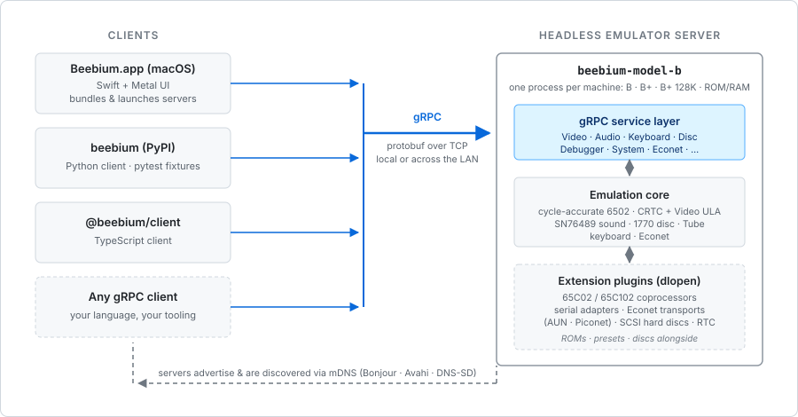

<p align="center">
  
</p>

# Beebium

<p align="center">
  <a href="https://github.com/rob-smallshire/beebium/actions/workflows/ci.yml"></a>
  <a href="https://github.com/rob-smallshire/beebium/actions/workflows/ci.yml"></a>
</p>

A different take on a BBC Micro emulator, with a Chromium-inspired architecture.

## Overview

Different emulators serve different purposes. Some prioritise nostalgia and game compatibility. Others focus on accuracy or preservation. **Beebium's primary goal is to serve as a foundation for tools for creating new software for the BBC Micro and its coprocessors.**

The architecture reflects this goal: a headless emulation core that runs as a server, with frontends connecting via gRPC. This separation will enable integration with IDEs, test harnesses, continuous integration pipelines, and custom development tools, not just standalone GUI emulators.

Moreover, this architecture also facilitates native GUIs with first-class host platform integration, rather than the compromises required by cross-platform graphics toolkits. The macOS frontend uses Swift and Metal. A Windows frontend can use WinUI 3 and Direct3D. A Linux frontend can use GTK or Qt. Each platform's code remains clean and idiomatic, unencumbered by the complexity of accommodating other platforms.

### Key Features

- **Cycle-accurate 6502 emulation** — NMOS and CMOS variants supported
- **Four machine variants** — Model B, B+, B+ 128K, and Model B with a ROM/RAM board
- **Floppy disc support** — SSD and DSD (DFS), ADFS (`.adf`/`.adl`/`.adm`/`.ads`) and HFE flux-level images, all with read/write
- **Pluggable peripherals** — each a loadable extension:
  - *Coprocessors* — Acorn 65C02 (3 MHz) and 65C102 (4 MHz) second processors
  - *Serial* — IP232, RFC 2217 (client and server), host serial port, and loopback adapters
  - *Econet transports* — AUN over UDP, and Piconet bridging to real Econet hardware
  - *Storage* — Acorn SCSI host adapter and SCSI hard-disc targets
  - *Real-time clock* — Acorn user-port RTC module
- **Headless core** — deterministic, UI-free emulation server
- **Process separation** — core and frontends communicate via gRPC
- **Platform-native frontends** — native UI using Cocoa and Metal on macOS

## Get Beebium

The complete emulator — the app, the servers, the ROMs, presets and extensions — is published on the [releases page](https://github.com/rob-smallshire/beebium/releases/latest).

### The macOS app

The full BBC Micro emulator in a single download. Grab the DMG for your Mac from the [latest release](https://github.com/rob-smallshire/beebium/releases/latest), open it, and drag **Beebium** into your Applications folder — there are separate builds for Apple Silicon (`macos-arm64`) and Intel (`macos-x86_64`). Or install it with Homebrew:

```bash
brew install --cask rob-smallshire/beebium/beebium-gui
```

Requires macOS 13 (Ventura) or newer.

*There is no Windows or Linux app yet. On those platforms, run Beebium through the headless servers below.*

### Headless servers, for developers

Drive Beebium from the **Python** or **TypeScript** client, from **CI**, or from your own **gRPC** client — or point the macOS app above at a server running on another machine (it discovers them on your LAN automatically via mDNS/Bonjour). Each package puts the four servers (Model B, B+, B+ 128K, ROM/RAM) on your `PATH`, with the ROMs and extensions bundled.

- **Any platform (Python)** — `pip install beebium beebium-server` (`beebium` is the client library; `beebium-server` ships the servers)
- **Linux** — self-contained `.deb` (Debian / Ubuntu / Raspberry Pi OS) and `.rpm` (Fedora / RHEL / openSUSE) for `amd64` and `arm64`, or a `.tar.gz` for any distro
- **macOS** — `brew install rob-smallshire/beebium/beebium-server`, or a self-contained tarball
- **Windows** — `scoop bucket add beebium https://github.com/rob-smallshire/scoop-beebium` then `scoop install beebium-server`, or a self-contained zip

Direct download links for every package are on the [releases page](https://github.com/rob-smallshire/beebium/releases/latest).

## Architecture



A single headless core serves every frontend over gRPC — a well-defined protocol boundary rather than a UI wired into the emulator. Frames flow through a lock-free queue, so a client may drop frames while the emulation loop runs on without ever blocking.

## Usage

If you installed the **macOS app**, just launch it and choose a machine — everything it needs is inside the bundle.

To drive Beebium programmatically — for testing, automation, or CI — use the Python client. Install it, with the optional server wheel, from PyPI:

```bash
pip install beebium beebium-server
```

With `beebium-server` present, `launch()` needs no arguments: it finds the server and its ROMs in that wheel.

```python
from beebium.client import Beebium

with Beebium.launch() as bbc:
    bbc.expect("BASIC")             # wait for the BASIC prompt
    bbc.keyboard.type("PRINT 2+2")
    bbc.keyboard.press_return()
    print(bbc.expect("4"))          # -> 4
```

The client can type on the keyboard, read the screen in any display mode, peek and poke memory, drive the debugger, and mount discs. See the [Python client README](https://github.com/rob-smallshire/beebium/tree/master/clients/beebium-python-client) for the full API, the pytest `bbc` fixture, and more examples. A [TypeScript client](https://github.com/rob-smallshire/beebium/tree/master/clients/beebium-typescript-client) (`npm install @beebium/client`) offers the same control from Node.

## Building from source

You need this only to **contribute to Beebium** or to run an unreleased version — users should install from the channels under [Get Beebium](#get-beebium).

### Prerequisites

- CMake 3.16+ and a C++20 compiler (Clang 14+, GCC 11+)
- gRPC and Protobuf — via Homebrew on macOS (`brew install cmake grpc protobuf`), your distro's `-dev` packages on Linux, or vcpkg on Windows
- Catch2 v3.x is fetched automatically
- For the Python client: Python 3.12+

### Server and core

```bash
cmake -B build -DCMAKE_BUILD_TYPE=Release
cmake --build build --parallel
```

The four server executables land in `build/src/server/` (`beebium-model-b`, `-model-b-plus`, `-model-b-plus-128k`, `-model-b-romram`); the `beebium-servers` target builds them all. Run the test suite with:

```bash
ctest --test-dir build --output-on-failure
```

Some integration tests run only when an optional tool (`beebasm`, `pySerial`, `tcpser`) is on the `PATH`, and skip cleanly otherwise — see [Testing with real 6502 code](docs/testing-from-disc.md).

### macOS app

The app **embeds the server executables in its bundle**, so the servers are built first. The CMake `macos-app` target does both:

```bash
cmake --build build --target macos-app    # build servers + app
cmake --build build --target macos-run    # ... and launch it
```

To work in Xcode directly, or for self-contained distribution builds, see [docs/building.md](docs/building.md) and [docs/macos-app-packaging.md](docs/macos-app-packaging.md).

### Python client

For development, install the client editable against your checkout:

```bash
pip install -e clients/beebium-python-client
```

## Project Structure

```
beebium/
├── src/
│   ├── 6502/           # Cycle-accurate 6502 library (C)
│   ├── core/           # Emulator core library (C++)
│   ├── service/        # gRPC service implementations
│   └── server/         # Standalone server executable
├── clients/
│   ├── macos/                      # Native macOS frontend (Swift)
│   ├── beebium-python-client/      # Python client library
│   └── beebium-typescript-client/  # TypeScript client library
├── tests/              # Catch2 test suite
├── docs/               # Documentation
└── scripts/            # Development scripts
```

## Documentation

Component and subsystem documentation lives in [`docs/`](docs/). Some entry points:

- [Building from source](docs/building.md) — prerequisites, per-platform and cross-architecture builds, targets
- [Deployment and resource discovery](docs/deployment.md) — installed layout; how a server finds ROMs and presets
- [Packaging and distribution](docs/packaging.md) — the self-contained server bundles and how they are built
- [gRPC server interface](docs/grpc-server.md) — the service API
- [Adding a coprocessor](docs/coprocessor-extension-guide.md) — writing a new second-processor extension
- [Versioning and compatibility](docs/versioning-and-compatibility.md) — release versioning and the protocol handshake

## Development

After cloning, install the git hooks:

```bash
./scripts/install-hooks
```

This sets up a pre-commit hook that verifies copyright notices in source files.

## License

Beebium is licensed under the [GNU General Public License v3.0](COPYING.txt).

## Acknowledgments

- **Tom Seddon** - The 6502 library is ported from [B2](https://github.com/tom-seddon/b2), Tom's excellent BBC Micro emulator
- **Matt Godbolt** - Creator of [jsbeeb](https://github.com/mattgodbolt/jsbeeb), from which VIA timing tests and 1MHz bus stretching logic were adapted
- **Chris Evans** (@scarybeasts) - Hardware-validated VIA timing data measured on real BBC Master hardware, and CRTC 6845 edge case tests from [beebjit](https://github.com/scarybeasts/beebjit)
- **Nicola Salmoria and MAME contributors** - Hardware-verified SN76489/SN76496 sound chip behaviors documented in [MAME](https://github.com/mamedev/mame), including LFSR tap positions, noise reset behavior, and chip variant differences
- **David Banks** (hoglet) - The Tube ULA register 3 FIFO test program from his [Tube ULA Re-Implementation](https://stardot.org.uk/forums/viewtopic.php?t=28080) thread, with measurements of a real Ferranti Tube ULA that Beebium's Tube register behaviour is validated against
- The BBC Micro community at [Stardot](https://stardot.org.uk/)

## Third-Party Libraries

- **moodycamel::ReaderWriterQueue** - Lock-free single-producer, single-consumer queue
  - Copyright (c) 2013-2021, Cameron Desrochers
  - Simplified BSD License
  - https://github.com/cameron314/readerwriterqueue
- **stb_image_write** - Single-file PNG/BMP/TGA/JPEG/HDR image writer
  - Copyright (c) 2017, Sean Barrett
  - MIT License / Public Domain
  - https://github.com/nothings/stb
